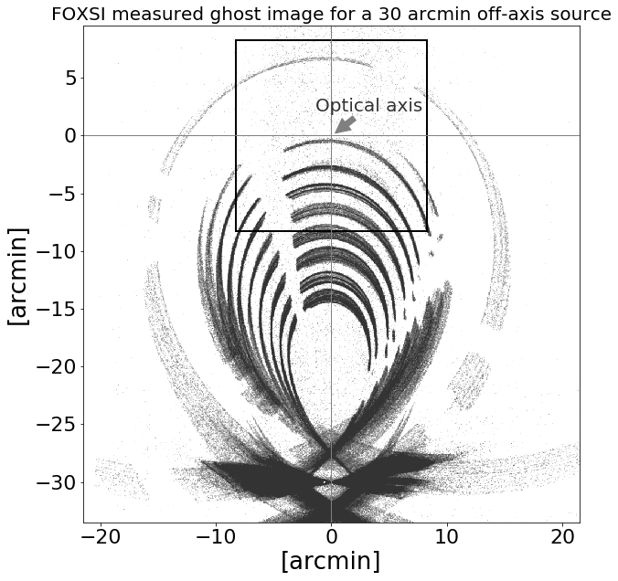

Grazing-Incidence Optics Simulation Tool
----------------------------------------

Introduction
------------

Wolter-I-figured glancing incidence X-ray telescopes have been used implemented 
in technology for medical physics, synchrotron accelerators, nuclear physics,
astrophysics, and space physics. The Wolter-I geometry consists of a combination
of two grazing mirror segments, a paraboloid primary followed by a hyperboloid 
secondary. In these telescopes, a focused image is formed when X-rays are 
reflected on both mirrors. A limitation of these optics is the problem with 
stray light, also known as a ghost rays which are unreflected, or singly 
reflected X-rays that can reach the focal plane. These form ghost images 
which are highly depended on the X-rays incident angle and energy of the x-rays.

This software package provides a tool to analyze and simulate the response
of difference wolter-1 (or conical approximations to Wolter-1) optics
to incidence x-rays to characterize ghost rays.

How to Install
--------------
To do complete install:

    sudo python setup.py install

To install in current directory:

    python setup.py install --home=.

or using pip while immediately outside the directory

    pip install -e foxsi-optics-sim

When installing to local directory, you need to update PATH 
and PYTHONPATH variables in order to use the foxsisim tools:

For linux, to the following, first open ~/.bashrc in a text editor and add
the following two lines where FOXSISIM_DIR is the location of your foxsisim 
root directory:
   
    export PATH=$PATH:"FOXSISIM_DIR/bin"
    export PYTHONPATH=$PYTHONPATH:"FOXSISIM_DIR/lib/python"

Examples and Gallery
--------------------
See the [example](examples/) folder for simple scripts on how to run setup and run
various simulation scenerios.

See the [gallery](gallery/README.md) folder for a gallery of different investigations 
of ghost rays.

Help
----
For help using the foxsisim module use python's help() command. 
For example:

    import foxsisim
    help(foxsisim)
    from foxsisim.module import Module
    help(Module)

Also, see the foxsisim/examples/ folder.

To run the GUI from the command line, type:
    
    foxsisim-gui.py

For help using foxsisim-gui, see the Quickstart guide located in the 
foxsisim/doc/ folder.

Authors
-------
This code was originally developed at NASA GSFC under the summer internship 
program by Robert Taylor (@rtaylor) and Steven Christe (@ehsteve). 

J.C. Buitrago-Casas (@pymilo), of UCB Space Sciences laboratory has also
significantly contributed to this codebase.

