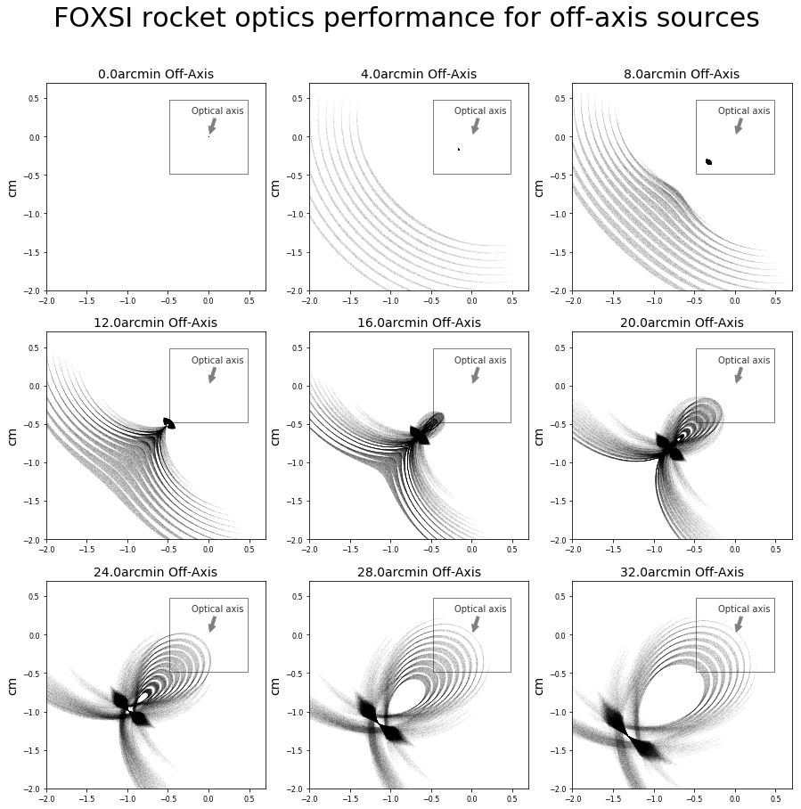

Gallery Example 2
-----------------

Simulated ghost rays for a 10-shell FOXSI rocket optics module as a function of 
off-axis angle for a source on the Sun from 0 to 32 arcminutes.
The black square shows the FOXSI detector field of view.
As the source moves away from the center of the field of view ghost rays begin
to form outside of the field of view and eventually infringe on the field of view
(for this example at 16 arcmin off axis).

The code to generate this figure can be found at [gallery_example2](gallery_example2.py)