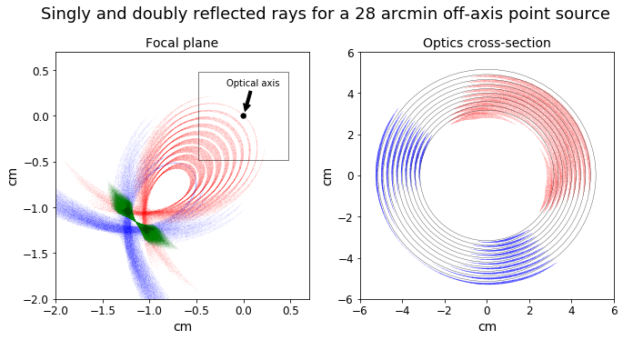

Gallery Example 3
-----------------

(Left) A simulated ghost ray pattern for a solar source at 28 arcminute off axis for a 
10-shell FOXSI rocket optics module. The image is color-coded to show
what reflections lead to what features or parts of the ghost ray pattern.

In green rays, the rays that reflect twice and are properly focused. 
In blue and red rays are rays that reflect once on the paraboloid and 
the hyperboloid segment respectively. 

(Right) A cross-section of the optics module showing the spatial distribution 
of the singly reflected rays differentiated by color.