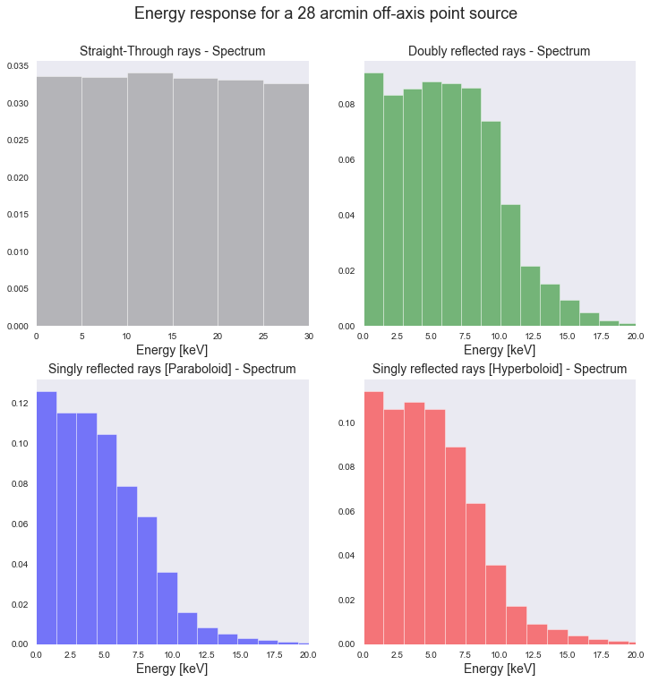

Gallery Example 4
-----------------

The simulated energy response of a point source on the Sun 28 arcminute off-axis
as observed by the FOXSI rocket mirror modules.
The spectrum of the source is assumed to be flat from 0 to 30 keV (upper left).

A total of 255 thousand rays were simulated for these plots.

