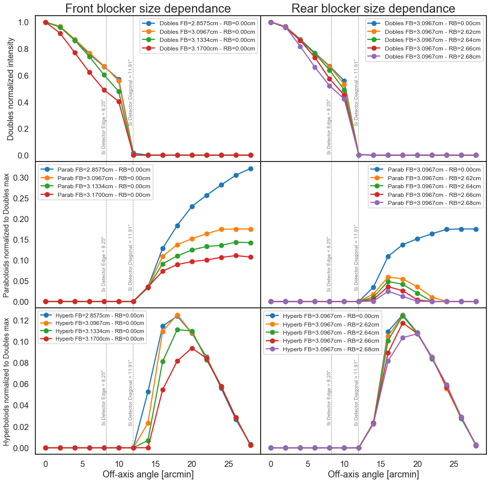

Gallery Example 5
-----------------

Simulated effect of the front (three plots on the left) and rear 
(three plots on the right) blocker sizes over the rays focused by the most 
inner Wolter-I figure of a 10-shell FOXSI optics module. Every plot 
shows simulated singly and doubly reflected rays flux that reaches the FOV 
of an on-axis silicon detector located at the focal plane as a function of 
the off-axis angle of a point source placed at one astronomical unit 
from the front of the optics. The plots in the first row show the 
double reflected rays flux. The plots in the secondand third row show the 
singly reflected rays flux coming from the paraboloid and the hyperboloid 
segment of the Wolter-I figure respectively. The colored curves correspond 
to different blocker radii as indicated in thelabels. 
All plots are normalized to the maximum flux of doubly reflected rays 
in each case. The gray dashed vertical lines indicate the minimum (left) 
and maximum (right) distance from the optical axis to the edge of 
the squared detector.

The code to generate this figure can be found at [gallery_example5](gallery_example5.py)

