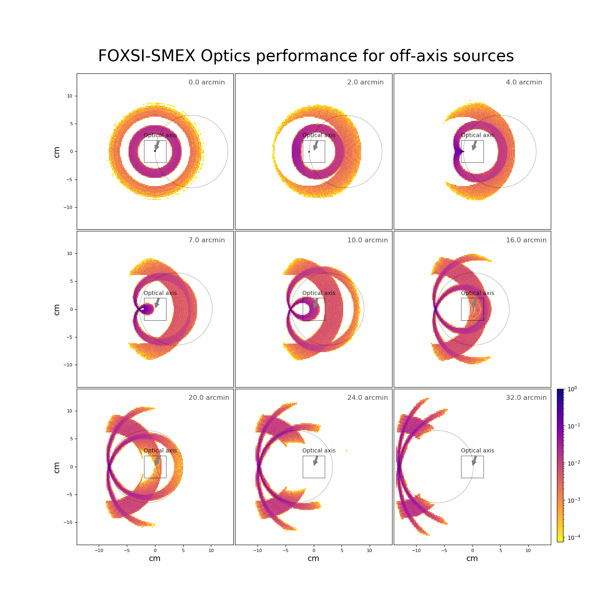

Gallery Example 7
-----------------

Simulated ghost rays for a 18-shell 14-m focal length FOXSI-SMEX or FOXSI on FIERCE optics module as a function of
off-axis angle for a source on the Sun from 0 to 32 arcminutes.
The black square shows the FOXSI detector field of view, and the black circle represents the solar disk.
